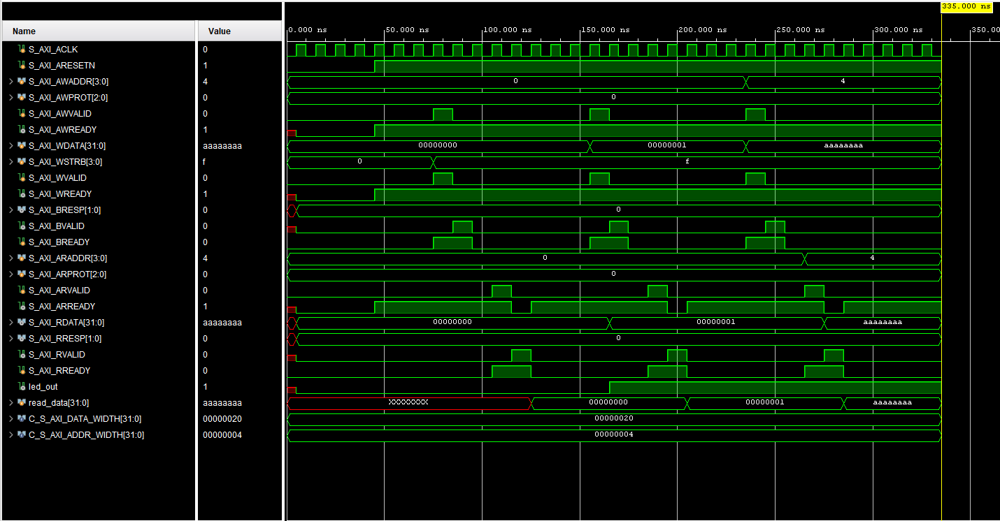

# AXI-Lite Controlled Peripheral - Cmod A7-35T

AXI-Lite based embedded system using a MicroBlaze processor and a custom peripheral for hardware control on the Digilent Cmod A7-35T.

## Features

* Custom AXI-Lite slave peripheral implemented in Verilog
* Memory-mapped register interface for hardware control
* MicroBlaze processor integration
* UART communication for software interaction
* Full simulation of AXI transactions
* Hardware validation on FPGA

## Hardware

* Board: Digilent Cmod A7-35T
* FPGA: Xilinx Artix-7 (xc7a35t)
* Clock: 12 MHz onboard oscillator

## How It Works

The system uses a MicroBlaze processor connected to a custom AXI-Lite peripheral through an AXI interconnect.

* Software writes to a memory-mapped register
* AXI-Lite interface transfers the data to the peripheral
* The peripheral updates its internal register
* The register drives the LED output

Read operations allow software to verify the register contents.

## Simulation



The simulation validates correct AXI-Lite protocol behavior and register functionality.

Write phase
`S_AXI_AWVALID` and `S_AXI_WVALID` are asserted with valid address and data. The slave responds with `S_AXI_AWREADY` and `S_AXI_WREADY`, confirming the transaction is accepted.

Register update
After the write handshake, the internal register updates. This is visible as data transitions from `00000000` to `00000001`, and later to `aaaaaaaa`.

Read phase
`S_AXI_ARVALID` initiates a read transaction. Once `S_AXI_ARREADY` is asserted, the slave returns data on `S_AXI_RDATA`.

Read-back validation
The read data matches the previously written values, confirming correct storage and retrieval.

Output behavior
The signal `led_out` follows the register value. When the register is written with a non-zero value, the output is asserted, confirming correct hardware control.

This confirms that the AXI-Lite interface, register logic, and output behavior operate as expected.

## Project Structure

* `SRC/` : synthesizable Verilog design
* `SIM/` : AXI-Lite testbench and waveform
* `XDC/` : board constraints
* `VITIS/` : MicroBlaze software
* `SCRIPTS/` : Vivado TCL project recreation

## Files

* `SRC/my_axi_led2.v` : AXI-Lite slave peripheral
* `SIM/tb_my_axi_led2.v` : simulation testbench
* `XDC/*.xdc` : board constraints
* `SCRIPTS/recreate_project.tcl` : recreate Vivado project

## How to Recreate the Vivado Project

Open Vivado TCL console and run:

```tcl
cd "AXI_LITE_CTRL_PERIPH/SCRIPTS"
source recreate_axi_lite_ctrl_periph.tcl
```
